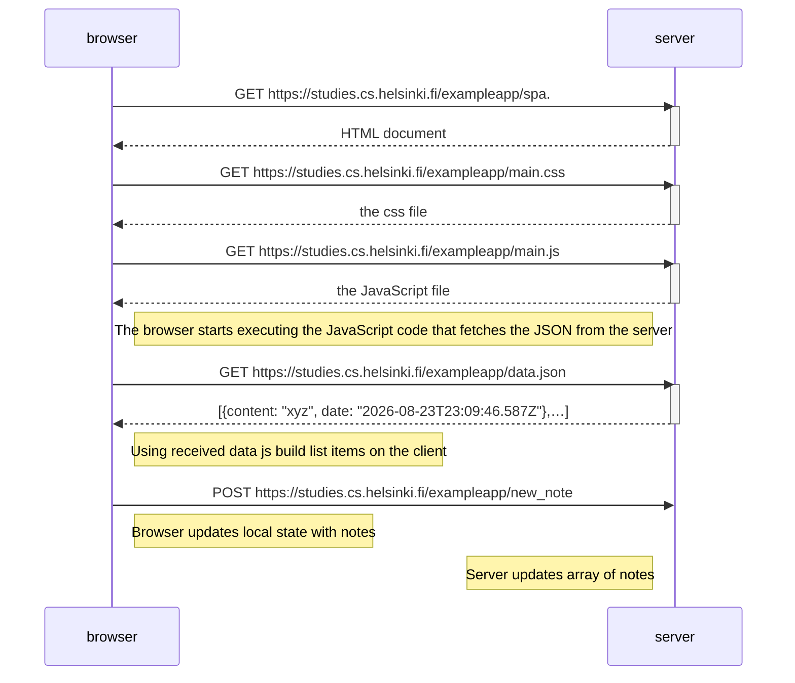

```mermaid
sequenceDiagram
participant browser
participant server

    browser->>server: GET https://studies.cs.helsinki.fi/exampleapp/spa.
    activate server
    server-->>browser: HTML document
    deactivate server

    browser->>server: GET https://studies.cs.helsinki.fi/exampleapp/main.css
    activate server
    server-->>browser: the css file
    deactivate server

    browser->>server: GET https://studies.cs.helsinki.fi/exampleapp/main.js
    activate server
    server-->>browser: the JavaScript file
    deactivate server

    Note right of browser: The browser starts executing the JavaScript code that fetches the JSON from the server
    
    browser ->> server: GET https://studies.cs.helsinki.fi/exampleapp/data.json
    activate server
    server -->> browser: [{content: "xyz", date: "2026-08-23T23:09:46.587Z"},…]
    deactivate server
    Note right of browser: Using received data js build list items on the client
    
    
    browser ->> server: POST https://studies.cs.helsinki.fi/exampleapp/new_note
    Note right of browser: Browser updates local state with notes
    activate server
    Note left of server: Server updates array of notes
```